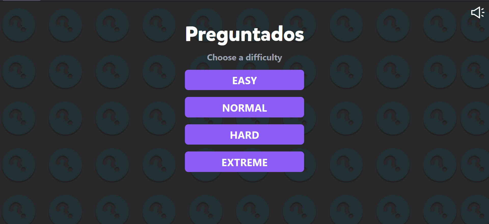

# How to run locally / Como correrlo localmente

Primero debemos clonar o descargar este repositorio, luego seguir los siguientes pasos!

First we need to clone or download the repository, next follow the following steps:

[LIVE](https://google.com/)

1. Instalar NodeJS (Version 14 en adelante) // Install NodeJS (Version 14 onwards).
2. Correr el comando npm install // Run npm install command
3. Correr el comando npm run dev. // Run npm run dev command
4. Abrir el enlace del localhost levantado (Se muestra en la terminal) // Open the link showed in the terminal.
5. A disfrutar! 😹 // Enjoy! 🙋

 

